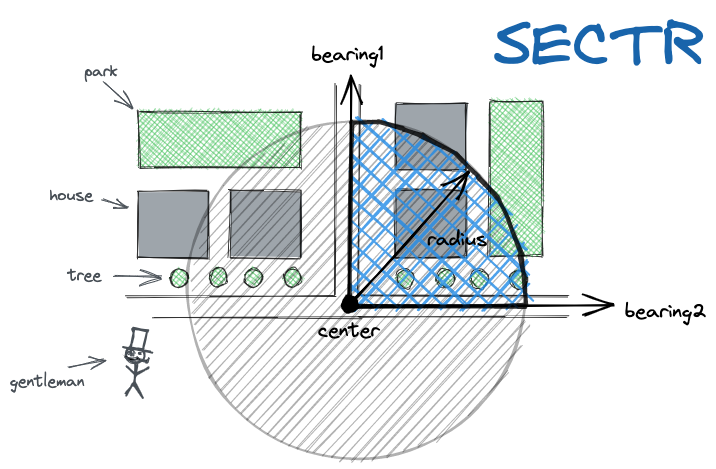

# sectr 🍕

Build a circular sector (pizza piece 😅 ) spanning the angle between two given bearings, a radius and a center point.

## installation

```
go get -u github.com/iwpnd/sectr
```

## usage

```go
package main

import (
  "fmt"

  "github.com/iwpnd/sectr"
  )

func main() {
   p := sectr.Point{Lat: 52.25, Lng: 13.37}
	sector := sectr.NewSector(p, 100, 0, 90)

  fmt.Printf("%s", sector.JSON())
}
```

<p align="center">

<p align="center">

## License

MIT

## Acknowledgement

[Chris Veness](https://github.com/chrisveness) for refreshing my university left-overs with this blog [moveable-type](https://www.movable-type.co.uk/scripts/latlong.html)

## Maintainer

Benjamin Ramser - [@iwpnd](https://github.com/iwpnd)

Project Link: [https://github.com/iwpnd/sectr](https://github.com/iwpnd/sectr)
