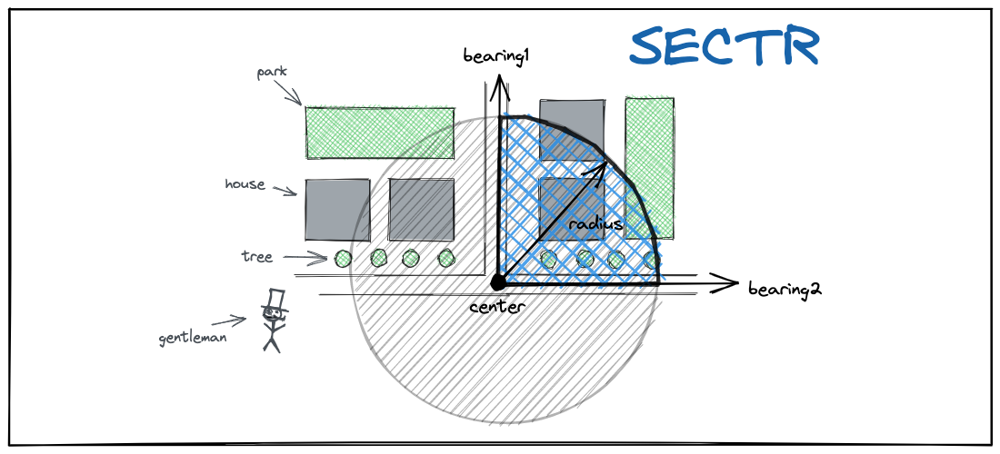

# sectr 🍕

Build a circular sector polygon feature (pizza piece 😅 ) spanning the angle between two given bearings, a radius and a center point.

## installation

```
go get -u github.com/iwpnd/sectr
```

## usage



```go
package main

import (
  "fmt"

  "github.com/iwpnd/sectr"
  )

func main() {
	p := sectr.Point{Lat: 52.25, Lng: 13.37}
	sector := sectr.NewSector(p, 100, 0, 90)

  fmt.Printf("%s", sector.JSON())
}

>> {
  "type": "Polygon",
  "coordinates": [
    [
      [13.37,52.25],
      [13.37,52.25089932],
      [13.37012803,52.2508959],
      [13.3702803,52.2508828],
      [13.37040491,52.25086448],
      [13.37055029,52.25083383],
      [13.37068965,52.25079405],
      [13.37080006,52.25075423],
      [13.37092446,52.2506989],
      [13.37103872,52.25063591],
      [13.3711253,52.25057807],
      [13.37121783,52.25050289],
      [13.37128479,52.25043599],
      [13.37135219,52.25035138],
      [13.37140478,52.25026293],
      [13.37143686,52.25018697],
      [13.37146091,52.250094],
      [13.37146896,52.24999999],
      [13.37,52.25]
    ]
  ]
}
```

## License

MIT

## Acknowledgement

[Chris Veness](https://github.com/chrisveness) for refreshing my university left-overs with this blog [moveable-type](https://www.movable-type.co.uk/scripts/latlong.html)

## Maintainer

Benjamin Ramser - [@iwpnd](https://github.com/iwpnd)

Project Link: [https://github.com/iwpnd/sectr](https://github.com/iwpnd/sectr)
